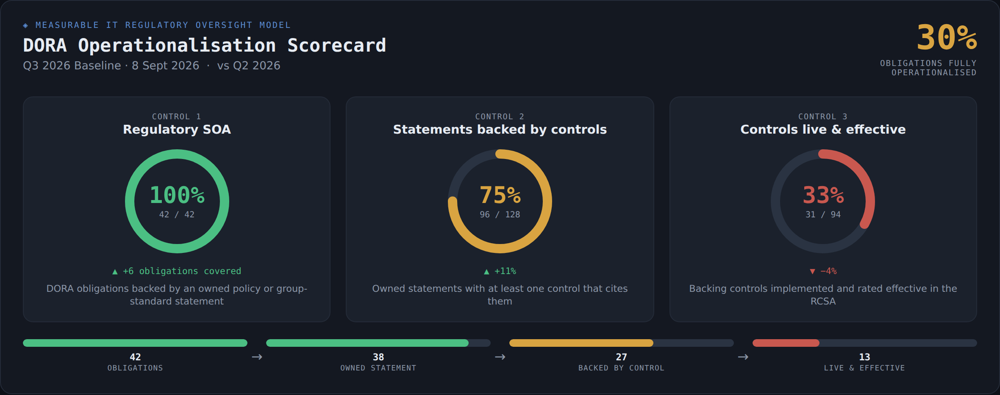

# Executive Report — Design Plan

Status: **plan / not yet built**. Decision taken: the current exec report
(operationalisation funnel + DORA-transition gauges) predates the three-control
model and will be **replaced** by the design below. Its key numbers are absorbed
into the new sections.

The report tells one story in three acts — **Control 1 → Control 2 → Control 3** —
the same spine as the dashboard and the evidence pages, so an exec who has seen
one has seen them all.

---

## 1. Design principles ("make it look cool", within our constraints)

Constraints: vanilla JS, no CDN, theme-aware (dark/light), and it must **print to
A4 landscape PDF** cleanly (board-ready). Everything below is inline SVG + CSS we
can already produce.

A small, consistent visual kit used throughout:

- **Radial gauges** (SVG rings) for headline percentages.
- **Progress bars** — green fill on a muted track (already in use).
- **Stacked horizontal bars** for dispositions (Implemented / E / WT / WP) and
  control status (Draft / Implemented / Tested / Effective).
- **Coverage matrix** — a compact grid of mini-bars (one row per article).
- **Stat pills** and **QoQ trend arrows** (▲/▼ vs the previous assessment — the
  generator already takes prev + current).
- **Colour semantics** (same everywhere): green = done / live / effective;
  amber = in progress / draft / temporary waiver; red = gap / uncovered /
  ineffective; accent-blue = DORA / informational.
- Big **numbered section dividers** ("Control 1 / 2 / 3") carry the narrative.

---

## 2. The report, section by section

### Hero — "DORA Operationalisation Scorecard"
A single at-a-glance band (mockup: `docs/exec-report-hero-mock.png`):

- Three radial gauges — **Control 1 %**, **Control 2 %**, **Control 3 %** — each
  with its fraction and a **QoQ delta**.
- One composite headline: **% of DORA obligations fully operationalised**
  (obligation → owned statement → backed by a control → control live & effective).
  This is the "weakest-link" truth and the number a board remembers.
- A **chain strip** underneath: Obligations → Owned statement → Backed by control
  → Live & effective, showing the drop-off at each stage.

### Act 1 — Control 1 · Regulatory SOA (DORA coverage)
A **per-article coverage matrix** — one row per DORA Article/RTS, with four
side-by-side mini progress bars, delivering spreadsheet rows 2–5 in one view:

| DORA Article/RTS | Capability | Covered | via Policy | via Group Std | via **Implemented** control |
|---|---|---|---|---|---|
| bar = obligations covered / total, per lens | | ▓▓▓ | ▓▓ | ▓ | ▓ |

- **Covered** — any owned statement (row 2, plus the capability tag).
- **via Policy** / **via Group Standard** — obligations whose covering statement
  is a local policy / a group standard (rows 3, 4). This is the policy-vs-standard
  breakdown we deliberately keep **off** the dashboard card (too busy there) and
  put **here**, where detail is wanted.
- **via Implemented control** — obligations whose mapped statement has a live
  control (row 5, "DORA Obligations IMPLEMENTED").

Header stats: total articles · fully covered · partial · uncovered.

### Act 2 — Control 2 · Policies & Group Standards
**Aggregate (rows 8–9):** two progress bars / gauges —
- Policy statements **operationalised** (with an implemented control) / total.
- Group-standard statements **operationalised** / total.

**Per-document detail (rows 12–16 for Group Standards; 19–21 for Policies):**
one block per policy / standard, showing:
- **Statement disposition** — stacked bar of Implemented (no waiver) · Exemption (E)
  · Temporary Waiver (WT) · Permanent Waiver (WP) (rows 12, 19).
- **Operationalised** — statements with an implemented control (rows 15, 20).
- **Control status mix** — stacked bar of Draft · Implemented · Tested · Effective
  (rows 16, 21).

**Compliance-hygiene callouts (rows 13, 14) — the standout exec insight:**
- ⚠ **Invisible work** — statements we mark as *implemented* (no waiver) but with
  **no control** tracking them (row 13). An audit blind spot.
- ⚠ **Stale / incorrect waivers** — statements carrying a waiver (E/WT/WP) that
  **do** have an implemented control (row 14). The waiver should be lifted.

Each callout shows a count and a drill list — "here are N things quietly wrong."

### Act 3 — Control 3 · Risk (controls treating risk)
Row 24 — "how effective are our controls at treating our risks":
- The **Control-3 operationalised & live summary** (reuses `buildBackingControlOps`
  and the risk register): controls implemented and rated effective, by risk.
- Proposed "cool" addition: a **residual-vs-effectiveness quadrant** (SVG scatter)
  — each risk a bubble on residual (x) × control effectiveness (y); the
  top-left "high residual / low effectiveness" quadrant is the danger zone.

### Close — "What needs attention" (suggested addition)
A single prioritised exec action list, pulled from the three action lists already
on the dashboard: uncovered high-materiality obligations, statements with no
control, and controls not yet live/effective — so the report ends on the
**closable** work, not just the score.

---

## 3. Requirements traceability (nothing dropped)

| Spec row | Section | Visual | Data source |
|---|---|---|---|
| 2 capability + coverage bar per article | Act 1 matrix | mini-bar + capability tag | `buildDoraObligations` (article.capability, covered/total) |
| 3 policy coverage per article | Act 1 matrix | mini-bar | mappedRefs where source = Local Policy |
| 4 group-standard coverage per article | Act 1 matrix | mini-bar | mappedRefs where source = Group Standard |
| 5 obligations covered by an implemented control | Act 1 matrix | mini-bar | mappedRefs where status = implemented |
| 8 policy statements operationalised | Act 2 aggregate | gauge/bar | `buildStatementCoverage` (source split + live control) |
| 9 group-standard statements operationalised | Act 2 aggregate | gauge/bar | `buildStatementCoverage` |
| 12 GS statement disposition counts | Act 2 GS detail | stacked bar | `buildGovernanceRows` + `ftException` |
| 13 GS invisible work (implemented, no control) | Act 2 callout | anomaly card | no-waiver + Uncovered (buildRtmClass) |
| 14 GS stale waiver (waiver + implemented control) | Act 2 callout | anomaly card | waiver + Built/Reused (buildRtmClass) |
| 15 GS operationalised statements | Act 2 GS detail | count/bar | buildRtmClass Built/Reused |
| 16 GS control status mix | Act 2 GS detail | stacked bar | facts: status + assessed + effective |
| 19–21 policy equivalents of 12/15/16 | Act 2 Policy detail | same, per policy | same builders, policy docs |
| 24 controls effective at treating risk | Act 3 | summary table + quadrant | `buildBackingControlOps`, `buildRiskProfile` |

---

## 4. Data work needed (small — most already exists)

Existing builders cover most of it: `buildDoraObligations`, `buildStatementCoverage`,
`buildBackingControlOps`, `buildGovernanceRows`, `buildRiskProfile`, and the
`qoqArrow`/`qoqTrend` helpers. New, additive pieces:

1. **Per-article coverage rollup** — per article: obligations total, covered,
   covered-by-policy, covered-by-group-standard, covered-by-implemented-control.
2. **Per-document control-status mix** — Draft / Implemented / Tested / Effective
   counts for the controls citing a document's statements.
3. **Two anomaly detectors** — invisible work; stale/incorrect waiver.
4. **Chain / "fully operationalised" metric** — obligations whose mapped statement
   has a live *and effective* control.
5. **SVG radial-gauge component** (reusable) + the coverage-matrix and quadrant
   renderers.

All derive from fields we already store (`policyRows.exception`, `buildRtmClass`
buckets, fact status/effectiveness, `mappedRefs`), computed for both the current
and previous assessment to drive the QoQ arrows.

---

## 5. Other things worth showing (my suggestions)

- **Composite readiness / weakest-link** headline (in the hero).
- **QoQ momentum** — a small multi-assessment sparkline of the three control
  percentages over time (are we improving?).
- **Capability leaderboard** — strongest / weakest ICT capabilities by DORA
  coverage (obligations now carry a capability).
- **Owner accountability** — who owns the biggest gaps (ownership rollup exists).
- **Waiver hygiene** — E vs WT vs WP mix + the stale-waiver count.
- **Data-confidence footnote** — assessment date + upload completeness, so a
  partial dataset isn't over-read.

---

## 6. Build sequence (when we implement)

1. Data rollups + anomaly detectors (+ unit-style Playwright checks on the numbers).
2. Reusable SVG gauge + progress/stacked-bar/matrix components.
3. Hero scorecard band.
4. Act 1 (coverage matrix) → Act 2 (aggregate, per-document, callouts) → Act 3
   (risk summary + quadrant) → Close (action list).
5. Wire QoQ (prev vs current) throughout; retire the old funnel/DORA-transition.
6. Print/A4 pass + "Copy for Excel" on the detail tables.

The mockup (`docs/exec-report-hero-mock.png`) shows the intended look for the hero;
the dashboard Control 1/2/3 cards already demonstrate the bar/table/callout styling
the sections will reuse.
